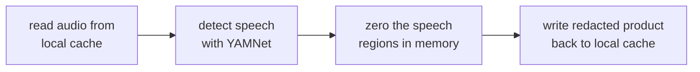
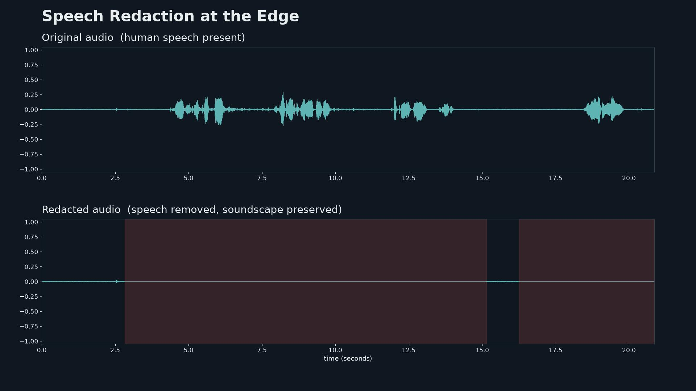

# speech-redaction

A Sage edge plugin that removes human speech from node audio before it is
persisted, so acoustic monitoring (e.g. BirdNET) can continue without
recording people.

It reads audio from the node's local cache, detects speech with YAMNet, zeroes the speech regions in memory, and writes a redacted audio product back into the cache for downstream plugins to consume. Only the redacted product is available to downstream consumers and for upload. The standalone speech-redaction plugin built is live in the **[Sage App Catalog](https://portal.sagecontinuum.org/apps/app/mighdz/speech-redaction)**.

## How it works

The speech regions are zeroed while the audio is still an in-memory array, so
this plugin never writes unredacted audio. The raw clips themselves currently
land on the node's SSD, written there by the upstream producer (media-sampler3),
with a move to a ramdisk planned.

## What it looks like

Top: the original audio, with human speech present. Bottom: the redacted
output, with the speech zeroed and the surrounding soundscape left intact.

## Usage

    # single file (dev/test)
    python3 main.py --input clip.wav --cache-root ./out --cache-name speech-redaction

    # consume from a cache stream (the real pattern)
    python3 main.py --from-cache /local-cache/hummingcam-audio/hummingcam_mic --cache-name speech-redaction \
        --cache-max-count 500 --cache-max-mb 2048

## Status

The redaction pipeline is built and tested, and verified running on an
NVIDIA Jetson AGX Thor. End-to-end validation of the full cache
consume-redact-produce loop with live audio is in progress.

See `ecr-meta/ecr-science-description.md` for the science writeup and
`docs/CACHE-PATTERN-MAP.md` for the cache design.
